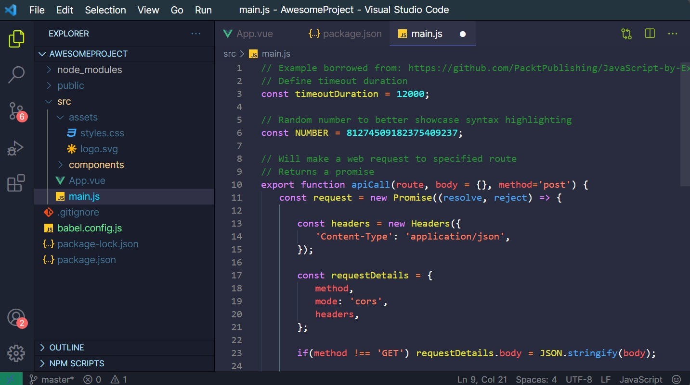

# <b>Verge </b> <i>Dark</i> 

 

## <b>Introduction ✨</b>
 
<b>Verge Dark</b> Theme is a dark colored theme dedicated to making you focus on code more than the <b>code editor🐱‍💻</b>.
Requires a <b>minimum of 1.56.2</b> Visual Studio Code version.

## <b>Issues😮?</b>
<b>This theme is not perfect yet.😅</b>  If you find any inconsistency in any language, you can help by reporting issues or PR [here](https://github.com/AsherCarneiro/Verge-Dark/issues), or leave a comment on marketplace.

## Want an <b>Light</b> Theme Version💡?

Coming<b> Soon!👨‍🔧</b>

## Want to <b>Contribute😎?</b>

I will accept all <b>valid PRs</b> for features and Bugs.  

- <b>Github Repo </b>[Here](https://github.com/AsherCarneiro/Verge-Dark)

 

